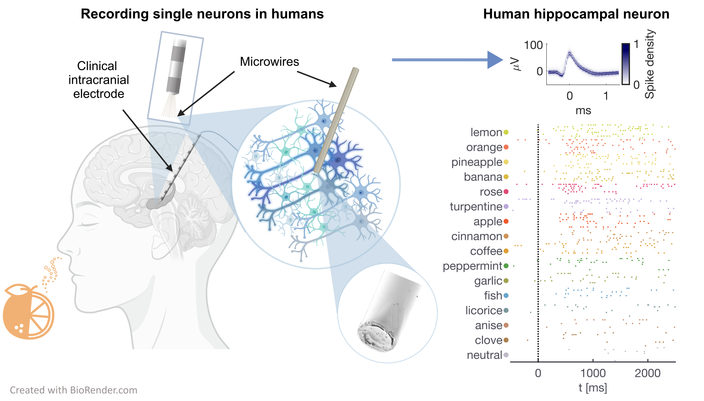

# Single-Neuron Representations of Odors in the Human Brain

 [](https://opensource.org/licenses/MIT)

## Contents
- [Overview](#overview)
- [Abstract](#abstract)
- [Requirements](#requirements)
- [Code and Data structure](#code-and-data-structure)
- [Istallation](#installation)
- [How to use the code](#how-to-use-the-code)
- [Citation](#citation)
- [License](./LICENSE)

# Overview
This repository contains codes and data associated with the paper *Single-Neuron Representations of Odors in the Human Brain*
by [Kehl et al. 2024](https://doi.org/XXXXXX).
In this study, we explore the processing of odors at the level of individual neurons in humans.



Readme for:
https://github.com/marcelkehl/HumanOdorRepresentations

# Abstract

>Olfaction is a fundamental sensory modality that guides animal and human behavior ([Gottfried, J. 2010](https://www.nature.com/articles/nrn2883), [McGann 2017](https://www.science.org/doi/10.1126/science.aam7263)). The underlying neural processes of human olfaction, however, are still poorly understood at the fundamental, i.e., the single-neuron level. Here, we report the first recordings of single-neuron activity in the piriform cortex and medial temporal lobe (MTL) in awake humans performing an odor-rating and identification task. We discover odor-modulated neurons within the piriform cortex, amygdala, entorhinal cortex, and hippocampus. In each of these regions, neuronal firing accurately encodes odor identity. Notably, repeated odor presentations reduce response firing rates, demonstrating central repetition suppression and habituation. Different MTL regions serve distinct roles in odor processing, with amygdala neurons encoding subjective odor valence, and hippocampal neurons predicting behavioral odor identification performance. While piriform neurons preferably encode chemical odor identity, hippocampal activity reflects subjective odor perception. Critically, we uncover that piriform cortex neurons reliably encode odor-related images, supporting a multimodal role of the human piriform cortex. We also observe striking cross-modal coding of both odors and images, especially in the amygdala and piriform cortex. Moreover, we discover neurons that respond to semantically coherent odor and image information, demonstrating conceptual coding schemes in olfaction. Our results bridge the long-standing gap between animal models and non-invasive human studies and advance our understanding of odor processing in the human brain by unveiling previously unknown neuronal odor-coding principles, regional functional differences, and cross-modal integration.

# Requirements 

## Software requirements
All codes are written in MATLAB (MathWorks, Natick, MA).
This software was tested using MATLAB (R2021a) on MacOS X and Windows 11.

The following MATLAB packages are required: 
* *Statistics and Machine Learning Toolbox*
* *Image Processing Toolbox*

## Hardware requirements
This code runs on a standard computer with a recommended minimum of 4 GB of RAM. 
A high-resolution monitor is recommended for accurate figure rendering.

# Code and Data structure

## Folder structure
- **Codes**
  - **Analysis**
  - **Helper**
- **Data**
- **Figures**

This repository contains three folders (**Data**, **Codes** & **Figures**).
The **Codes** folder contains the **Analysis** and **Helpers** subfolders.
For the analysis of each main figure of the manuscript, there is a dedicated script in the **Codes** folder called `HumanOdorRep_Fig_X_x_*`. 
Each script loads the data from the **Data** folder and stores the resulting figure in **Figures**. 
The **Helper** folder includes functions used by multiple analysis scripts.

# Installation
Download or clone this repository:

```bash
git clone https://github.com/marcelkehl/HumanOdorRepresentations
cd HumanOdorRepresentations
```

# How to use the code 

Navigate to the **Codes/Analysis** folder.
The analysis of individual figures can be regenerated by running the corresponding figure code.

For example, the analysis of Fig. 1f can be performed by: 

```matlab
cd(fullfile(PATH_to_this_repository,'Codes','Analysis'))
HumanOdorRep_Fig_1_f_behavior()
```
        
# Citation

## Cite as
Kehl, M.S. et al. 2024, *Single-Neuron Representations of Odors in the Human Brain*. (DOI:XXX)

## Study Authors
Marcel S. Kehl, Sina Mackay, Kathrin Ohla, Matthias Schneider, Valeri Borger, Rainer Surges,
Marc Spehr, Florian Mormann

# License
This project is licensed under the terms of the MIT License.
Copyright (c) by Marcel S. Kehl.

------------------------------------------------------------------------------------------

